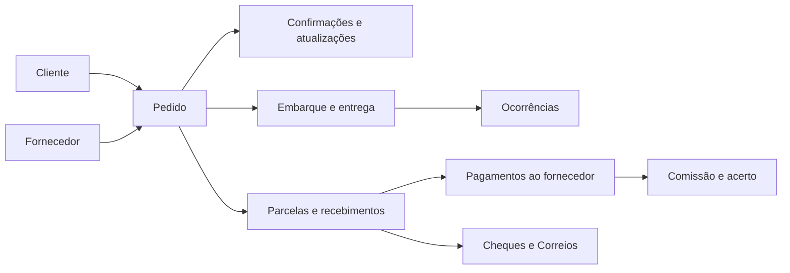

# Plataforma Ogura Rep — Especificação do protótipo

## 1. Objetivo

Construir um protótipo navegável e responsivo de uma plataforma para centralizar a gestão operacional da Ogura Rep e demonstrar como as planilhas atuais poderão ser substituídas.

O protótipo deverá representar todo o processo da empresa e permitir a simulação da inclusão e edição dos grupos de informação encontrados nas planilhas. Os arquivos fornecidos são amostras parciais: seus registros servirão como dados demonstrativos, mas não limitam a quantidade futura de clientes, fornecedores, pedidos ou movimentações.

## 2. Escopo da entrega

### Incluído

- Aplicação web responsiva para desktop, tablet e celular.
- Login simulado com perfis funcionais.
- Dashboard priorizando pendências operacionais.
- Navegação por todos os módulos definidos nesta especificação.
- Listagens, filtros, detalhes, painéis laterais, formulários e confirmações simuladas.
- Dados demonstrativos derivados das planilhas fornecidas.
- Cálculos apresentados na interface para líquidos, descontos, diferenças, parcelas, comissões e saldos.
- Estados vazios, de carregamento, erro, validação e acesso negado.

### Fora do escopo

- Backend, API e banco de dados.
- Persistência permanente de alterações.
- Migração ou importação das planilhas pela interface.
- Autenticação real, recuperação de senha e integrações externas.
- Envio efetivo de e-mails, mensagens, notificações ou dados aos Correios.
- Publicação em ambiente de produção nesta fase.

## 3. Princípio de organização

O pedido será a entidade central. Clientes, fornecedores, comunicações, embarques, entregas, ocorrências, parcelas, pagamentos, cheques, postagens, cobranças, comissões e acertos estarão relacionados a ele.

Essa organização substitui a separação artificial por planilhas e permite acompanhar a jornada completa em um único detalhe de pedido.

## 4. Usuários e permissões

### Administrador

- Acesso a todos os módulos e dados.
- Visualização da área de usuários e perfis.
- Simulação de criação, edição e desativação de usuários.

### Comercial

- Dashboard operacional.
- Clientes e fornecedores.
- Pedidos, confirmações, atualizações e comunicações.
- Embarques, entregas e ocorrências.
- Consulta resumida da situação financeira do pedido, sem ações administrativas financeiras.

### Financeiro/Administrativo

- Dashboard operacional e financeiro.
- Consulta de clientes, fornecedores e pedidos.
- Parcelas, recebimentos, pagamentos e cobranças.
- Cheques, postagens e rastreamento.
- Comissões, acertos e relatórios.

A interface deverá ocultar ações não autorizadas e apresentar um estado de acesso negado quando uma rota restrita for acessada diretamente.

## 5. Navegação e módulos

### 5.1. Login

- Identidade visual da Ogura Rep.
- Seleção ou entrada simulada de usuário.
- Indicação do perfil associado.
- Acesso rápido aos três perfis para demonstração.

### 5.2. Dashboard

Prioridade visual para o trabalho que exige ação:

- pedidos aguardando confirmação do fornecedor;
- pedidos aguardando confirmação do cliente;
- orçamentos aguardando estoque, preço, quantidade ou prazo;
- informes de carga pendentes;
- embarques e entregas do dia;
- ocorrências abertas;
- parcelas próximas do vencimento ou atrasadas;
- pagamentos e cobranças pendentes;
- comissões aguardando acerto.

O dashboard também terá pedidos recentes, resumo por status, atalhos de criação e filtros por período, responsável, fornecedor e região.

### 5.3. Orçamentos e pedidos

- Tabela responsiva com busca, filtros e ordenação.
- Filtros por número, cliente, fornecedor, responsável, status, cidade, região, data e embarque.
- Ação simulada de novo orçamento ou pedido.
- Confirmação de estoque e preço com o fornecedor.
- Confirmação de itens, quantidades e prazo com o cliente.
- Conversão simulada do orçamento confirmado em pedido.
- Detalhe em abas: **Resumo**, **Itens e valores**, **Comunicações**, **Carga e entrega**, **Financeiro**, **Ocorrências** e **Histórico**.
- Linha do tempo com ações e mudanças de status.

### 5.4. Clientes

- Lista e detalhe de clientes.
- Nome ou razão social, contatos, e-mail, cidade, estado e região.
- Condições usuais de pagamento.
- Histórico de pedidos, entregas, ocorrências e situação financeira.

### 5.5. Fornecedores

- Lista e detalhe de fornecedores.
- Contatos e dados de identificação.
- Pedidos e embarques relacionados.
- Regras demonstrativas de comissão e desconto à vista.
- Resumo de valores, pagamentos, diferenças e acertos.

### 5.6. Logística

- Embarques e informes de carga.
- Conferência entre informe e pedido.
- Nota, nota fiscal, guia de vendas e cópias encaminhadas.
- Motorista, rota, mapa ou suporte, previsão e data da entrega.
- Conferência do material no desembarque.
- Pagamentos ao motorista e recibos.

### 5.7. Ocorrências

- Ocorrências ligadas a pedido, embarque e cliente.
- Tipos: item faltante, produto incorreto e outra divergência.
- Descrição, responsável, prioridade, status e histórico.
- Registro simulado das providências tomadas com o fornecedor.

### 5.8. Financeiro

- Contas a receber e contas a pagar.
- Parcelas e vencimentos.
- Recebimentos dos clientes e pagamentos aos fornecedores ou motoristas.
- PIX, cheque, boleto, depósito e pagamento direto.
- Diferenças, sobras, faltas, descontos e valores extras.
- Cobranças abertas, atrasadas, visitas e coletas.

### 5.9. Cheques e Correios

- Condição de pagamento, vencimento e valor previsto.
- Número do cheque, titular, valor e data “bom para”.
- Destinatário, responsável e forma de uso do cheque.
- Serviço postal, código, rastreio, custo, postagem, previsão e entrega.
- Fatura, observações, valor pago, valor a receber e diferença.

### 5.10. Comissões e acertos

- Período e fornecedor.
- Pedidos incluídos no acerto.
- Mercadoria, frete, ICMS, sobra, falta e líquido.
- Percentual de desconto à vista.
- Percentual e valor da comissão.
- Total a pagar, pagamentos realizados, extras e saldo.
- Visualização pronta para representar o Relatório de Acerto.

### 5.11. Relatórios

- Pedidos por período, cliente, fornecedor, status e região.
- Recebimentos, pagamentos, diferenças e vencimentos.
- Embarques, entregas e ocorrências.
- Comissões e acertos por fornecedor.
- Visão anual equivalente ao controle da Brasil Flora, sem repetir a grade extensa da planilha.

### 5.12. Administração

- Usuários e perfis.
- Simulação de criação, edição, ativação e desativação.
- Matriz resumida das permissões de Administrador, Comercial e Financeiro/Administrativo.

## 6. Modelo de informações do pedido

### Identificação e relacionamento

- número único do pedido;
- número do representante;
- número da Ogura;
- referência LR;
- cliente;
- fornecedor;
- responsável;
- data do pedido;
- cidade, estado e região;
- contato e e-mail;
- condições de pagamento;
- observações.

### Itens do orçamento ou pedido

- descrição do produto;
- categoria ou tipo do produto;
- unidade de medida;
- quantidade;
- preço unitário e valor total;
- disponibilidade ou confirmação de estoque do fornecedor;
- prazo informado ao cliente;
- observações do item.

### Confirmações e comunicação

- pedido enviado ao fornecedor;
- confirmação do fornecedor;
- cópia enviada ao cliente;
- confirmação do cliente;
- atualização enviada e confirmada pelo fornecedor;
- cópia da atualização enviada e confirmada pelo cliente;
- histórico de comunicação e data de cada ação.

### Embarque e entrega

- data de embarque;
- informe de carga;
- nota e nota fiscal;
- motorista e rota;
- previsão de entrega;
- data efetiva da entrega;
- confirmação do desembarque;
- situação da conferência do material.

### Valores comerciais

- valor da mercadoria;
- frete;
- ICMS;
- sobra;
- falta;
- descontos;
- recebimentos ou extras;
- valor líquido;
- valor à vista e a prazo;
- descontos à vista de 2,5%, 3%, 4% ou 5%, conforme a regra representada;
- comissão e valor pós-comissão.

### Movimentações financeiras

- parcela e quantidade total de parcelas;
- vencimento;
- destinatário do pagamento;
- valor previsto;
- data e valor realizado;
- meio, forma e operação;
- banco, agência e conta quando aplicáveis;
- situação e diferença;
- observação da movimentação.

## 7. Status padronizados

### Pedido

- Rascunho;
- Orçamento em elaboração;
- Aguardando estoque ou preço;
- Orçamento enviado;
- Aguardando fornecedor;
- Aguardando cliente;
- Confirmado;
- Em produção ou preparação;
- Embarque informado;
- Em trânsito;
- Entregue;
- Com ocorrência;
- Concluído;
- Cancelado.

### Financeiro

- A receber;
- A pagar;
- Próximo do vencimento;
- Atrasado;
- Pago parcialmente;
- Pago;
- Em conferência;
- Com diferença.

### Ocorrência e postagem

- Aberta;
- Em tratamento;
- Aguardando fornecedor;
- Resolvida;
- Postagem preparada;
- Postado;
- Em trânsito;
- Entregue;
- Devolvido.

## 8. Fluxos demonstráveis

### Fluxo comercial

1. Entrar com perfil Comercial.
2. Consultar pendências no dashboard.
3. Abrir a lista de orçamentos e pedidos.
4. Simular a criação de um orçamento.
5. Preencher cliente, fornecedor, itens, quantidades, condições e valores.
6. Simular a confirmação de estoque, preço e prazo.
7. Converter o orçamento em pedido.
8. Simular confirmações e envio de cópias.
9. Visualizar a atualização na linha do tempo durante a sessão.

### Fluxo de entrega e ocorrência

1. Abrir um pedido com embarque informado.
2. Consultar carga, motorista, rota e previsão.
3. Simular a confirmação de entrega.
4. Abrir uma ocorrência por item faltante ou produto incorreto.
5. Simular o acionamento do fornecedor e a mudança de status.

### Fluxo financeiro

1. Entrar com perfil Financeiro/Administrativo.
2. Consultar vencimentos e cobranças no dashboard.
3. Abrir uma parcela.
4. Simular recebimento por PIX ou cheque.
5. Conferir valor realizado e diferença calculada.
6. Consultar pagamento ao fornecedor e comissão relacionada.

### Fluxo de cheque e Correios

1. Selecionar um cheque recebido.
2. Consultar titular, valor e data “bom para”.
3. Simular uma postagem.
4. Exibir código de rastreio, custo e previsão.
5. Simular a atualização para postado ou entregue.

### Fluxo de acerto

1. Selecionar fornecedor e período.
2. Visualizar pedidos incluídos no acerto.
3. Conferir líquido, desconto à vista, comissão e total.
4. Consultar pagamentos registrados e saldo.
5. Abrir a visualização do relatório de acerto.

## 9. Direção visual

A referência aprovada é a opção A apresentada no companion visual.

- Fundo com degradês suaves em azul, lilás, rosa e laranja.
- Superfícies translúcidas com desfoque, bordas claras e sombras discretas.
- Cartões predominantemente brancos com baixa opacidade.
- Roxo como cor de ação e navegação.
- Azul para informação e acompanhamento.
- Laranja para atenção, vencimentos e alertas.
- Vermelho reservado para erros e atrasos críticos.
- Cantos arredondados e espaçamento amplo.
- Ícones simples acompanhados de texto quando houver espaço.
- Tabelas com densidade moderada, filtros visíveis e detalhes em painel lateral.

### Navegação responsiva

- Desktop: sidebar expandida por padrão, com opção de recolhimento.
- Desktop e tablet: modo compacto com ícones e dicas de contexto.
- Celular: sidebar substituída por barra inferior com Dashboard, Pedidos, Logística, Financeiro e Mais.
- A preferência de sidebar permanecerá somente durante a sessão do protótipo.

## 10. Arquitetura técnica

- React para composição da interface.
- TypeScript para tipagem dos modelos e dados demonstrativos.
- Vite para desenvolvimento e build.
- Roteamento no cliente para módulos e detalhes.
- Componentes organizados por domínio, com elementos compartilhados de layout, tabela, formulário, status, modal e painel lateral.
- Dados locais tipados extraídos das amostras.
- Estado em memória para simular alterações durante a sessão.
- Nenhuma dependência de backend.

## 11. Comportamento de formulários e cálculos

- Formulários aceitarão dados e executarão validações no cliente.
- A submissão válida mostrará confirmação e atualizará temporariamente a interface.
- O recarregamento restaurará os dados demonstrativos originais.
- Valores derivados serão recalculados no cliente para demonstrar líquido, diferença, descontos, comissão e saldo.
- Campos condicionais aparecerão conforme o meio de pagamento ou tipo de ocorrência.
- Uma mensagem persistente e discreta informará que se trata de um protótipo sem gravação permanente.

## 12. Estados e tratamento de erros

- Campo obrigatório ausente: mensagem próxima ao campo e foco no primeiro erro.
- Valor ou data inválida: explicação curta com exemplo de formato esperado.
- Ação sensível: modal de confirmação antes da simulação.
- Perfil sem permissão: página de acesso negado com retorno seguro.
- Busca sem resultado: estado vazio com opção de limpar filtros.
- Lista sem registros: mensagem contextual e ação principal apropriada.
- Erro demonstrativo: painel recuperável com botão para tentar novamente.
- Carregamento: esqueletos visuais sem bloquear toda a navegação.

## 13. Acessibilidade e responsividade

- Navegação completa por teclado.
- Estados de foco visíveis.
- Rótulos associados aos controles.
- Contraste suficiente sobre superfícies translúcidas.
- Áreas clicáveis adequadas para toque.
- Tabelas transformadas em cartões ou listas resumidas em telas estreitas.
- Formulários em uma coluna no celular e até duas colunas em telas maiores.
- Conteúdo principal sem rolagem horizontal obrigatória.

## 14. Validação do protótipo

- Testes dos componentes compartilhados.
- Testes da visibilidade e do bloqueio por perfil.
- Testes dos fluxos comercial, entrega, ocorrência, financeiro, cheque e acerto.
- Verificação das rotas e ações simuladas.
- Verificação visual em larguras representativas de celular, tablet e desktop.
- Conferência de todos os grupos de campos presentes nas quatro planilhas.
- Conferência da fidelidade aos dados demonstrativos extraídos das amostras.
- Verificação de foco, rótulos, contraste e áreas clicáveis.

## 15. Critérios de aceitação

O protótipo estará aceito quando:

1. Todos os módulos definidos puderem ser acessados conforme o perfil.
2. Os fluxos demonstráveis puderem ser concluídos sem becos sem saída.
3. Os formulários representarem todos os grupos de informação encontrados nas planilhas.
4. Pedidos integrarem dados comerciais, logísticos e financeiros em um único detalhe.
5. O dashboard destacar pendências operacionais antes dos indicadores financeiros.
6. A sidebar puder alternar entre os modos expandido e compacto.
7. A navegação inferior funcionar no celular.
8. A interface seguir a linguagem de transparência, cor e simplicidade da referência.
9. A troca de perfil alterar menus, ações e acessos visíveis.
10. Ficar claro que alterações simuladas não são persistentes.
